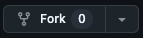

# professor-frontend

# Configure o ambiente de desenvolvimento

## VsCode

### Linux 
- Via terminal:
  - sudo snap install --classic code

### MacOS
- Baixe o Visual Studio Code: https://code.visualstudio.com/
- Abra o arquivo .dmg e arraste o VSCode para a pasta Aplicativos.

### Windows
- Baixe o instalador do Visual Studio Code do site oficial.
- Execute o instalador e siga as instruções na tela.

## Node 20

### Linux e MacOS
- Via terminal:
  - curl -o- https://raw.githubusercontent.com/nvm-sh/nvm/v0.39.5/install.sh | bash
  - source ~/.bashrc
  - nvm install 20
  - nvm use 20

### Windows
- Baixe o NVM para Windows do repositório oficial: https://www.youtube.com/watch?v=La6kH33-AVM
- Abra o terminal
  - node --version
    - Deve aparecer a versão instalada

 ## Docker

 ### Linux
 - https://www.digitalocean.com/community/tutorials/how-to-install-and-use-docker-compose-on-ubuntu-20-04

 ### MacOS
 - Baixe o Docker Desktop do site oficial: https://www.docker.com/products/docker-desktop/
 - Abra o arquivo .dmg e arraste o Docker para a pasta Aplicativos.

 ### Windows
 - Baixe o Docker Desktop do site oficial: https://www.docker.com/products/docker-desktop/
 - Execute o instalador e siga as instruções na tela.

 Obs.: Nenhum login é necessário no Docker

  ## Docker-compose

  ### Linux
  - Baixar a versão mais recente do Docker Compose
    - sudo curl -L "https://github.com/docker/compose/releases/latest/download/docker-compose-$(uname -s)-$(uname -m)" -o /usr/local/bin/docker-compose

  - Dar permissão de execução
    - sudo chmod +x /usr/local/bin/docker-compose

  - Verificar a instalação
    - docker-compose --version

  ### Windows e MacOS
  - Se você instalou o Docker Desktop, o Docker Compose já está incluído. Para verificar, abra o terminal e execute:
  - docker-compose --version

- Realize um Fork da aplicação.

   

# Executar aplicação localmente
- Abra o terminal e garanta que você está dentro do repositório.
  - npm i
    - Caso tenha algum problema de permissão no windows execute (como administrador): Set-ExecutionPolicy RemoteSigned 
  - npm start

  - Para a aplicação funcionar localmente por completo é necessário subir a aplicação de backend
    - Seguir o passo-a-passo no READ.ME do professor-backend

# Acesso
- A aplicação ficará disponível na porta 3000
- http://localhost:3000
